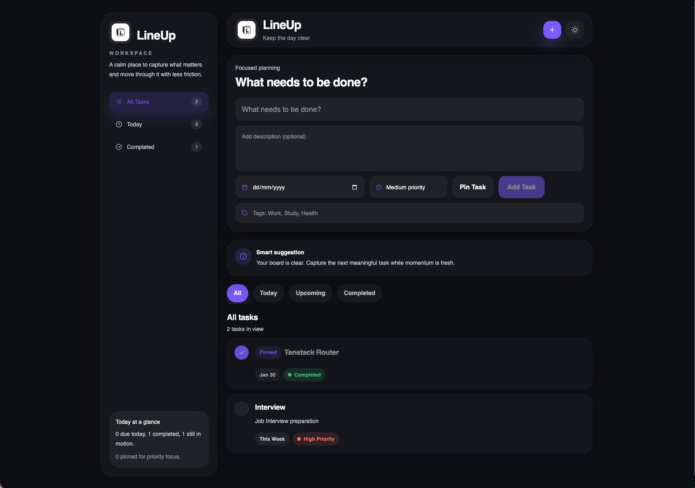
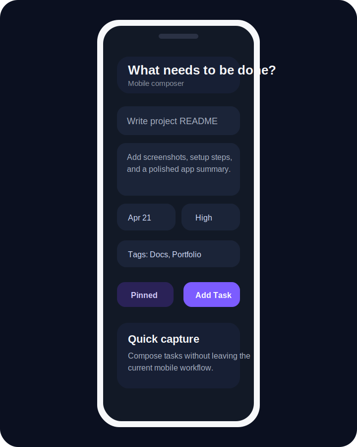

# LineUp

LineUp is a responsive task management app built with React, Vite, and Tailwind CSS. It is designed for fast daily planning with a calm visual style, priority-based organization, and local persistence so users can manage work without creating an account or depending on a backend.

## Overview

LineUp helps users capture tasks quickly, stay focused on high-priority work, and review progress through simple filters and status cues. The interface is optimized for both desktop and mobile, with a full sidebar workspace on larger screens and a streamlined composer flow on smaller devices.

## Highlights

- Create, edit, pin, and delete tasks from a single workflow.
- Add descriptions, deadlines, tags, and priority levels to each task.
- Filter tasks by all, today, upcoming, and completed states.
- Persist tasks and theme preference in the browser with localStorage.
- Switch between dark and light themes.
- Use the mobile quick-add modal for smaller screens.

## Features

### Task Management

- Add tasks with a title, optional description, deadline, tags, and priority.
- Edit existing tasks without leaving the main workspace.
- Mark tasks complete or incomplete with a single click.
- Pin important tasks so they stay at the top of the board.

### Focus and Organization

- Surface due-today, upcoming, and completed views instantly.
- Show task metadata for due date and priority at a glance.
- Generate simple insights based on overdue, due-today, and pinned tasks.

### Responsive Experience

- Desktop layout with a dedicated sidebar and board view.
- Mobile composer modal for quick task entry.
- Theme-aware styling and polished transitions across breakpoints.

## Screenshots

### Desktop workspace



### Mobile task composer



## Tech Stack

- React 19
- Vite 8
- Tailwind CSS 4
- React Icons
- UUID

## Getting Started

### Prerequisites

- Node.js 20.19 or later
- npm 11 or later

### Installation

```bash
npm install
```

### Run locally

```bash
npm run dev
```

Open the local development URL shown in the terminal.

### Production build

```bash
npm run build
```

### Preview the production build

```bash
npm run preview
```

## Available Scripts

- `npm run dev` starts the development server.
- `npm run build` creates the production bundle.
- `npm run preview` serves the production build locally.
- `npm run lint` runs ESLint across the project.

## Project Structure

```text
src/
	App.jsx
	App.css
	index.css
	main.jsx
	components/
		Navbar.jsx
public/
	Lineup.png
```

## Privacy and Data

LineUp currently stores task data and theme preference in the browser using localStorage. No user accounts, backend services, or external APIs are required for the current version.

## Portfolio Summary

LineUp is a minimalist productivity app focused on clarity, speed, and everyday usability. It demonstrates responsive React UI design, client-side state management, browser persistence, and polished interface work within a lightweight front-end architecture.
